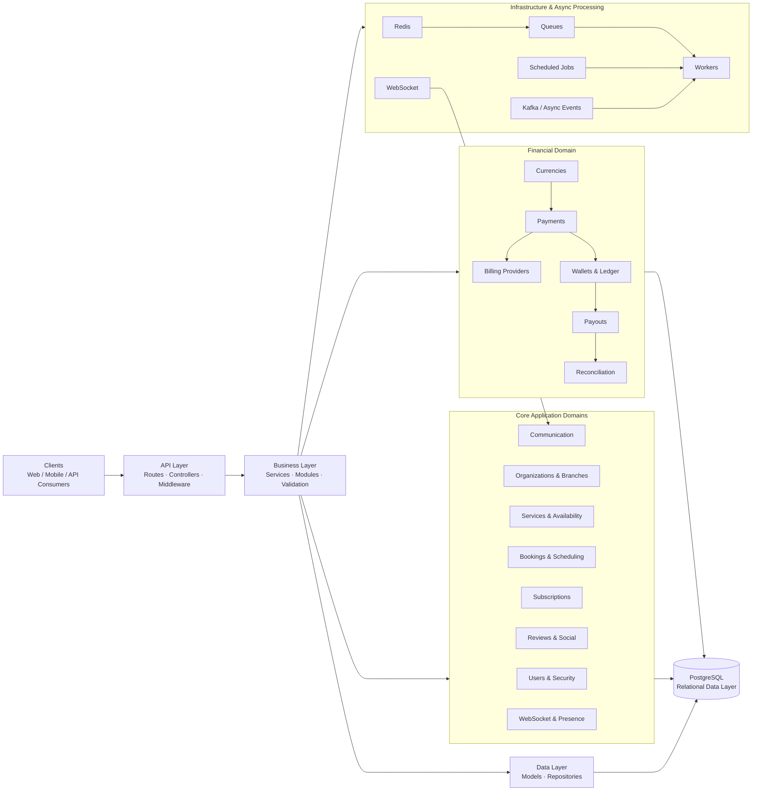

# Backend Architecture Diagram

## Architecture Layers

- **API Layer:** Routes, controllers, and middleware.
- **Business Layer:** Services, modules, and validation.
- **Data Layer:** Domain models and repositories.
- **PostgreSQL:** Relational persistence and data integrity.

## Main Domains

- Users and security
- Organizations and branches
- Services and availability
- Bookings and scheduling
- Subscriptions
- Reviews and social features
- Communication
- Payments and billing
- Wallets and financial ledger
- Payouts
- Currency management
- Reconciliation

## Infrastructure

- Redis
- Queues
- Background workers
- Scheduled jobs
- WebSocket communication
- Kafka / asynchronous event processing

> This is a sanitized architecture diagram modeled from the documented backend structure. Production source code, credentials, private schemas, customer data, and sensitive business logic are excluded.
